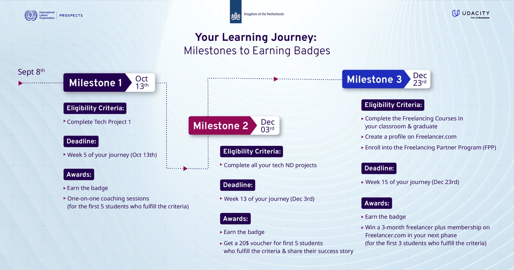

  

# Business Analytics & Digital Freelancing Nanodegree Program

  
 

This repository contains all the tasks, course projects, and detailed summaries from the **Business Analytics & Digital Freelancing Nanodegree Program** which is part of the **2024 ILO Freelance Fast Forward Program**, powered by Udacity in partnership with the International Labour Organization (ILO).

---

## 📜 Program Overview  

The **ILO Freelance Fast Forward Program** is a fully-funded initiative aimed at empowering residents of Egypt with technical and freelancing skills. Participants can choose from one of three tracks:  
- **Business Analytics and Digital Freelancing**  
- **Digital Marketing and Digital Freelancing**  
- **Front-End Web Developer and Digital Freelancing**  

The program is an exclusive opportunity provided by the International Labour Organization through its **PROSPECTS Programme** in Egypt, in collaboration with Udacity.
    

---

## 📂 Repository Structure
- **`Course Summaries/`**  
  Contains detailed summaries for each course, including key concepts, tools, and learning outcomes.
  
- **`Projects/`**  
  Includes completed projects, source code, and any additional deliverables for the program.

---

## 📚 Course Progress Overview
| **Course** | **Description** | **Status** |
|------------|------------------|------------|
| **Course 1**: Begin Your Journey | Orientation and program overview | ✅ Complete |
| **Course 2**: Working with Data | Data dashboards and insights | ✅ Complete |
| **Course 3**: Introduction to Data | Descriptive statistics, Excel modeling | 🔄 In Progress (99%) |
| **Course 4**: Using SQL for Data Analysis | Core SQL commands, joins, aggregations | ✅ Complete |
| **Course 5**: Data Visualization in Tableau | Building interactive dashboards | ✅ Complete |
| **Course 6**: Freelancing 101 | Digital freelancing basics, marketing | ✅ Complete |
| **Course 7**: Managing Freelancing Projects | Client sourcing, project management | ✅ Complete |
| **Course 8**: Next Steps | Future opportunities and program conclusion | ✅ Complete |
| **Course 9**: Resume Review (Optional) | Personalized resume feedback | ✅ Complete |

---

## 💻 Tools & Technologies
- **Spreadsheet Software:** Excel, Google Sheets  
- **Data Visualization:** Tableau  
- **Databases:** SQL (MySQL, SQLite)  
- **Programming Languages:** Python  

---

## 🌟 Technical Projects
### 📊 [Analyze NYSE Data](Projects/3_IntroductiontoData/)
**Description:** Analyze financial performance data from NYSE-listed companies to create income statements and forecast financial metrics.  
**Skills:** Data analysis, Excel modeling, financial forecasting.

### 🎵 [Query a Digital Music Store Database](Projects/4_UsingSQLforDataAnalysis/)
**Description:** Use SQL to optimize business practices for a digital music store.  
**Skills:** SQL queries, aggregations, joins, data cleaning.

### 📈 [Build a Data Visualization Project](Projects/5_DataVisualizationinTableau/)
**Description:** Create interactive Tableau dashboards to visualize data insights effectively.  
**Skills:** Tableau, storytelling with data, dashboard design.

---

## 🚀 How to Use This Repository
1. **Explore Summaries**: Navigate to `Course Summaries/` for a concise summary of each course content.
2. **Review Projects**: Visit the `Projects/` folder to access detailed project descriptions and source files.
Feel free to clone this repository and explore my journey through the Nanodegree program!

---

## 👩‍💻 About Me

I am passionate about delivering innovative and high-quality solutions. With expertise in building websites fully functioning including the UI, mobile applications backend apis, and AI-driven systems, I am committed to empowering businesses with cutting-edge technology. 
I have enhanced my skills in business analytics and digital freelancing during this program. This repository showcases my progress, learning, and dedication to achieving excellence in the field.  

  
 
      

## 📧 Contact Me  

If you have any questions or would like to collaborate, feel free to reach out:  

   
 
 
  

---

## 🏆 Acknowledgments  

This repository is made possible by the support of:  
- **Udacity**  
- **International Labour Organization (ILO)**  
- **PROSPECTS Programme**  

